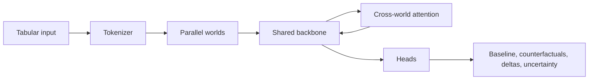
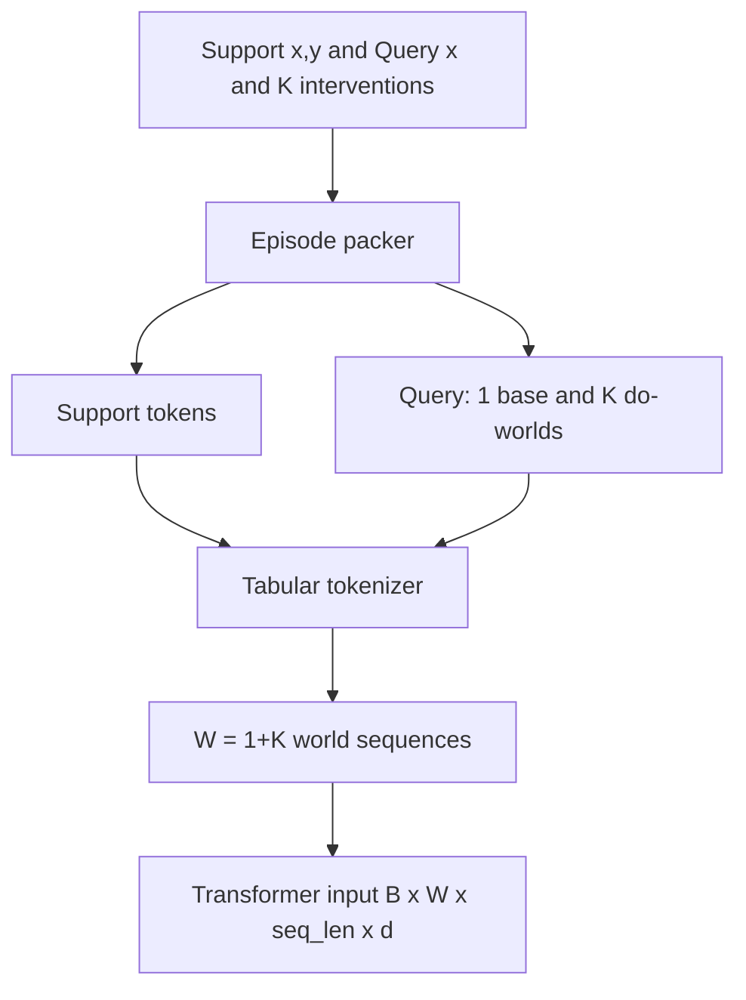
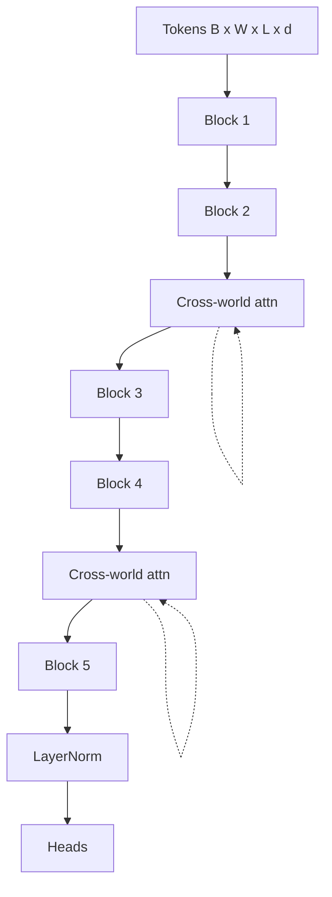
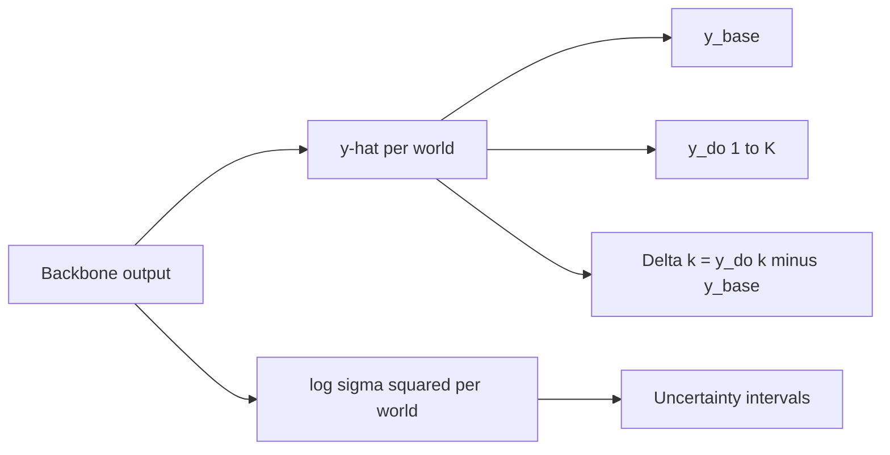

# Parallel Universe Transformers: Model, Goal, Story & Motivation

Single reference document: model description, goal, use cases, novelty, comparison with Do-PFN, and architecture diagrams (start to finish).

---

## 1. Goal (one sentence)

**Goal:** Build a black-box tabular meta-learner that, from observational data and without a causal graph at inference, predicts **baseline outcomes**, **counterfactual outcomes**, and **causal deltas** for **many interventions per sample** in one forward pass, by using a **parallel-world** architecture and training on synthetic SCMs.

---

## 2. What the model does (scientific)

- **Input:** Support set (x, y) and query x; plus a set of K interventions (e.g. do(X_j = v_j)).
- **Representation:** For each query unit we create **W = 1 + K “worlds”**: one baseline (no intervention) and K intervention worlds. Each world is a full token sequence (tabular tokens + world/role/feature IDs).
- **Computation:** A **shared transformer** processes all W worlds in parallel (batch dimension B×W). At selected layers, **inter-world cross-attention** lets each world attend to the others’ query tokens.
- **Output:** Per-world predictions \(\hat{y}_w\) and (optionally) \(\log\sigma^2_w\). **Deltas** are defined in the model: \(\hat{\Delta}_k = \hat{y}_{do,k} - \hat{y}_{base}\).
- **Training:** On synthetic SCM episodes: regression loss (e.g. Gaussian NLL) on \(\hat{y}_w\) and a **delta-consistency loss** on \(\hat{\Delta}_k\) vs true \(y_{do,k} - y_{base}\).

So: one model, one forward pass, many worlds and many effects; effects are first-class outputs, not post-hoc differences.

---

## 3. Story and motivation

**Motivation:**  
Real-world decisions often require many “what-if” questions per unit (e.g. many features and values). Doing this with explicit causal graphs is costly; with in-context causal methods (e.g. Do-PFN), everything is packed into one sequence and the **comparison** (baseline vs counterfactuals) is only implicit. We want a design that makes “baseline vs many counterfactuals” and “effect = difference” explicit and scalable.

**Story:**  
We adopt the intuition of **parallel realities**: one “baseline” world and K “intervention” worlds run in parallel. The model doesn’t just predict each world in isolation; worlds **communicate** via cross-attention. We train it so that the **difference** between worlds (the delta) matches the true causal effect from synthetic SCMs. So the model learns to estimate effects by explicitly comparing parallel worlds, without ever seeing a graph at test time.

---

## 4. Comparison with Do-PFN

| Aspect | Do-PFN / Causal PFN-style | Parallel Universe Transformers (ours) |
|--------|---------------------------|----------------------------------------|
| **Interventions** | Encoded **inside one** long context (e.g. “support + query + intervention description” in a single sequence). | **Separate parallel streams**: one sequence per world (baseline + K interventions). |
| **Multi-intervention** | Many interventions → longer single sequence; one query = one forward pass per intervention or a very long context. | **One forward pass** for 1 + K worlds; batch dimension is B×W. |
| **Effect (delta)** | Effect is **implicit**: you get counterfactual predictions and subtract. No architectural bias for “effect” as a direct object. | **Delta is explicit**: \(\hat{\Delta}_k = \hat{y}_{do,k} - \hat{y}_{base}\) in the model; **delta-consistency loss** trains this directly. |
| **Inductive bias** | General in-context learner; causal structure is in the data format, not in the layout of the model. | **Structural bias**: “baseline vs counterfactuals” and “compare across worlds” are built in via parallel worlds + cross-world attention. |
| **Use case** | Flexible “one intervention (or few) per call” causal prediction. | **Many interventions per sample** and direct effect estimation with a single call. |

**In short:** Do-PFN treats interventions as part of the context in one sequence; we treat each intervention as its own world and let worlds interact, and we train and output deltas explicitly.

---

## 5. Use cases

- **Policy / decision support:** “For this unit, what’s the effect of changing feature A vs B vs C?” in one model call.
- **Sensitivity / attribution:** Many do-interventions (e.g. do(X_i = x_i)) to see which variables drive the outcome.
- **Fairness / recourse:** “What would the outcome be under different protected-attribute or recourse interventions?” for many interventions per individual.
- **Synthetic SCM benchmarks:** Pre-trained on synthetic SCMs, then evaluated on held-out SCM families or real data (with appropriate caveats).

---

## 6. Novelty (short)

1. **Parallel-world architecture:** 1 + K dedicated world streams with shared backbone and inter-world cross-attention, instead of encoding all interventions in one sequence.
2. **Delta as a first-class output:** Architectural definition of \(\hat{\Delta}_k\) and a dedicated delta-consistency loss.
3. **Scalable many-intervention queries:** One forward pass for baseline + K counterfactuals and K deltas, with a clear inductive bias for comparing worlds.

---

## 7. Model diagrams (start to finish)

### 7.1 End-to-end pipeline

### 7.2 Input → tokenizer → worlds

Labels are quoted and nodes declared separately so Mermaid parses them correctly (avoids syntax errors from parentheses and special characters).

### 7.3 Backbone and cross-world attention

### 7.4 Outputs

---

*Single reference for model, goal, story, motivation, and diagrams. Mermaid in 7.2 uses quoted node labels and separate node/edge blocks to avoid syntax errors. You can expand with full Do-PFN references or a “Related work” section in a follow-up.*
